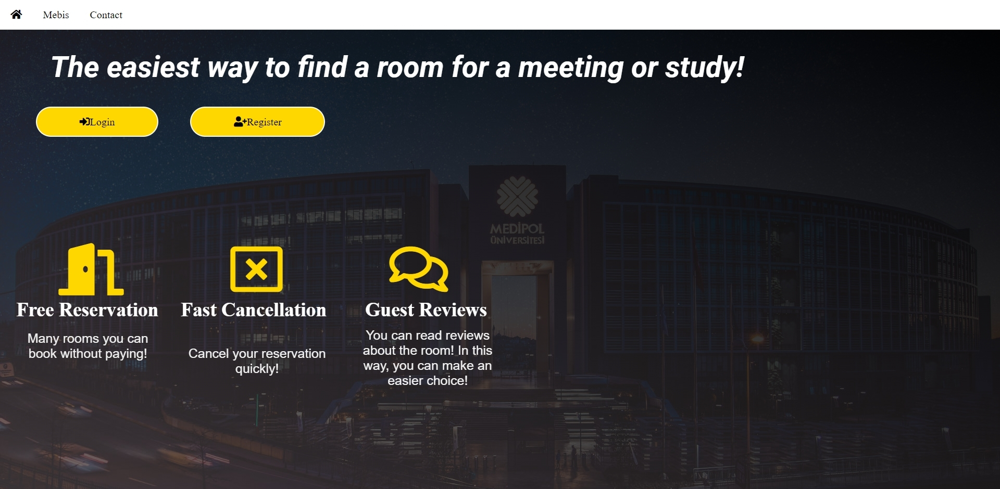
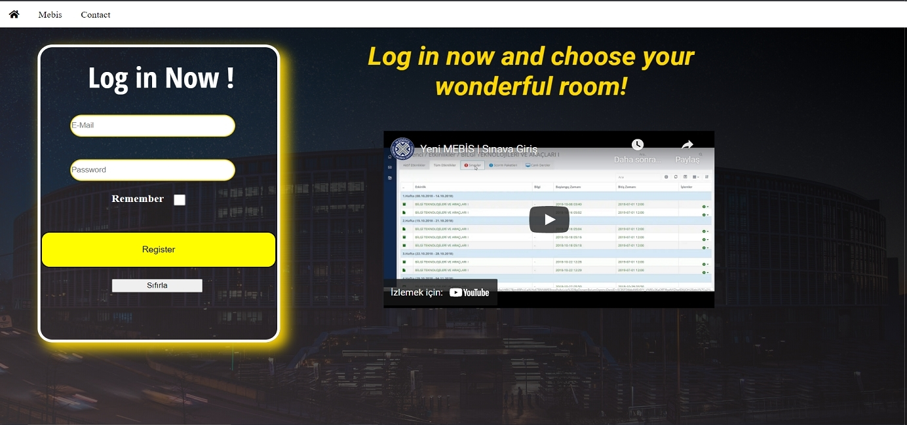
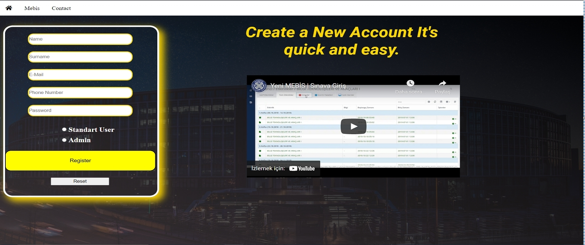
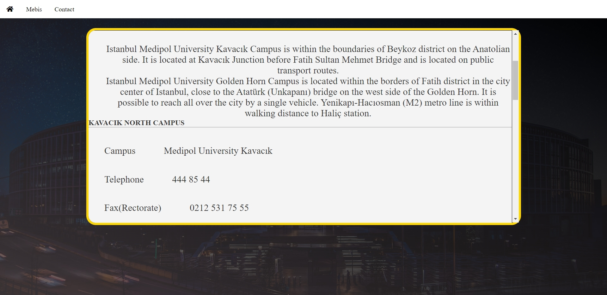

# School-Activity-Organization
Organizing things like organizing events at school, renting rooms, meeting, holding meetings. 
- There is an Admin Login - Admins have all privileges 
- Users can rent classes according to the hours they want 
- View the status of other classes - Ability to login 
- Ability to register 
- Keeping information in the database

 
 
 

